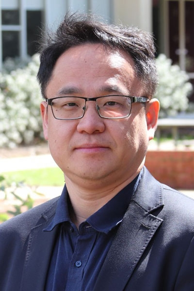

- Date: Tuesday, 9 April 2024
- Time: 13:30-
- Location: Room SR2, Yagami campus, Keio University
- Host: Prof Tomoaki Otsuki

### Abstract:

Terahertz (THz) communications are envisioned as an up-and-coming and pivotal wireless technology for the sixth generation (6G) and beyond era. In particular, the ultra-wide THz band ranging from 0.1 to 10 THz offers enormous potential to alleviate the spectrum scarcity and break the capacity limitation of emerging wireless systems (such as 4G-LTE and 5G NR). This will undoubtedly support epoch-making wireless applications that demand ultra-high quality service requirements and multi-terabits per second data transmission in the intelligent information society in the 2030s, such as terabit-per-second backhaul systems, ultra-high-definition content streaming among mobile devices, and virtual/augmented reality. In this talk, I will introduce the role and importance of THz communications for the 6G and beyond wireless networks, while briefly describing the fundamental research on THz devices, channels, testbeds, and simulators. After this, I will give a brief summary of recent research advances in THz communications, focusing on performance analysis, spectrum allocation, and hybrid beamforming. Finally, I will discuss some pressing challenges for harnessing the benefits of THz communications in the next decades.

---

## Nan Yang, Australian National University, Australia

### Bio:

A/Prof. Nan Yang received the Ph.D. degree from Beijing Institute of Technology, China, in March 2011. Since July 2014, he has been with the College of Engineering, Computing and Cybernetics at the Australian National University, Canberra, Australia, where he is currently an Associate Professor, the Lead of the Information and Signal Processing Cluster, and the head of the Emerging Communications Laboratory in the School of Engineering (SoEN). He is an IEEE ComSoc Distinguished Lecturer (Class of 2023—2024). He received the IEEE ComSoc Asia-Pacific Outstanding Young Researcher Award in 2014, and the Best Paper Awards from the IEEE GlobeCOM 2022, IEEE GlobeCOM 2016 and IEEE VTC Spring 2013. He is serving on the Editorial Board of the IEEE Transactions on Molecular, Biological, and Multi-Scale Communications and the IEEE Communications Letters, and was serving on the Editorial Board of the IEEE Transactions on Wireless Communications and the IEEE Transactions on Vehicular Technology. His research interests include terahertz communications, ultra-reliable and low-latency communications, cyber-physical security, intelligent communications, and molecular communications.
