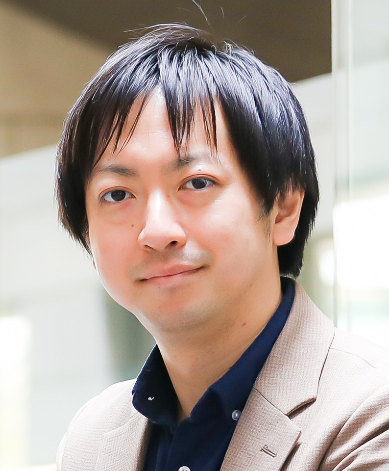

- 日時：4/17（水）16:00〜
- 会場：[名古屋大学](https://www.nagoya-u.ac.jp/contact/directions.html)[IB電子情報館9階917輪講室](https://www.engg.nagoya-u.ac.jp/access/)
- 講師：[東京大学・高前田（山﨑）伸也 先生](https://sites.google.com/site/shinyaty/home-japanese)
- 題目：信頼されるAIシステムを支えるコンピューティング技術
- 主催：IEEE 名古屋支部 Education Activity，名古屋大学工学研究科情報・通信工学専攻
- 協賛：[IEEE名古屋支部](https://ieee-jp.org/section/nagoya/)
- 後援：IEEE ComSoc Tokyo Joint Chapter，信学会東海支部

## タイトル：

信頼されるAIシステムを支えるコンピューティング技術

## アブストラクト：

AI・機械学習が、情報処理技術および社会システムにおいて果たす役割は日に日に大きくなる一方である。その中でも中心的な機械学習技術である深層学習の成長は、数理・アルゴリズム面での発展だけでなく、コンピューティングプラットフォームの進化により支えられている。今日の機械学習は、高い認識・生成能力だけでなく、公平性、説明可能性、秘匿性といった「信頼」に関わる側面も重要視されており、機械学習システムに求められる計算能力は増す一方である。そのため、更なる機械学習の高度化のためには、学習から運用に至るまでのあらゆる場面で利用されるコンピュータのエネルギー効率と速度向上が必要不可欠である。

本講演では、AI・機械学習を支えるコンピューティング技術の概要を述べた後、講演者が研究を進めている、アルゴリズムとハードウェアの協調による信頼されるAIシステムを実現するための高効率コンピューティング技術について紹介する。

---

## 講師：高前田（山﨑）伸也 先生

### ご略歴：

2014年東京工業大学大学院情報理工学研究科博士課程修了、博士（工学）。

同年4月から2016年9月まで奈良先端科学技術大学院大学 助教。

同年10月から2019年9月まで北海道大学 准教授。

同年10月から現在，東京大学 准教授。

2018年10月から2022年3月までJSTさきがけ研究者。

2023年科学技術分野の文部科学大臣表彰・若手科学者賞受賞。

コンピュータアーキテクチャ、ハードウェア高位設計技術、ドメイン特化アーキテクチャに関する研究に従事。
