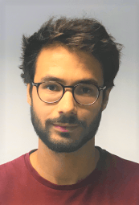

- Date: Friday, April 19, 14:00 - 17:00
- Location: Faculty Conference Room, IB Denshi-Joho-kan 5F, Nagoya University.
  - See [Nagoya University interactive campus map (C3-1)](https://www.nagoya-u.ac.jp/extra/map/index.html).
- Registration: [Please click here to register for online participation.](https://forms.gle/qouZzWsWW5XXdreG9)
- Host: Prof. Takaya Yamazato
- Organized by [IEEE ComSoc Tokyo Joint Chapter](https://yamazato.nuee.nagoya-u.ac.jp/IEEE-ComSoc-Tokyo-Joint-Chapter/) and [Nagoya University Yamazato Laboratory](https://yamazato.nuee.nagoya-u.ac.jp/en/)
- Supported by [IEICE WBS Technical committee](https://www.ieice.org/~wbs/), [JPC Optical Wireless Subcommittee](http://j-photonics.org/vlca/en/), and [IEEE Nagoya Section Education Activity](https://ieee-jp.org/section/nagoya/)

### Schedule
Click the title to download the presentation slide.

- 14:00 - 14:45 [Optical Wireless Communications Research at LISV - An Overview -](20240419-Bastien-Bechadergue-Nagoya-University.pdf)
  - A/Prof. Bastien Béchadergue (Université de Versailles Saint-Quentin-en-Yvelines, FRANCE)
- Break (15 min)
- 15:00 - 15:30 Optical Wireless Communications Toward B5G networks: From Terrestrial to Underwater Scenarios
  - Dr. Chedlia BEN NAILA（Assit. Prof., Nagoya University）
- 15:30 - 15:00 Mr. Iyoda (Ph.D. student, Nagoya University)
- 16:00 - 16:30 [Light-Trail-based Parallel Transmission for Image Sensor Communication](20240419-VLC_ShortCourse_Tang.pdf)
  - Dr. Zhengqiang TANG (post-doc, Nagoya University)
- 16:30 - 17:00 Dr. Lu (lecturer, Nagoya University)

---

## A/Prof. Bastien Béchadergue (Université de Versailles Saint-Quentin-en-Yvelines, FRANCE)

### Bio:

Bastien Béchadergue received an aeronautical engineering degree from ISAE-Supaero, Toulouse, France, and an M.S. in communication and signal processing from Imperial College London, London, UK, in 2014, followed by a Ph.D. in signal and image processing from UVSQ, Université Paris-Saclay, France, in 2017, for his work on visible light communication and sensing for automotive applications. Between 2017 and 2020, he was in charge of the research activities at Oledcomm, one of the major companies in the development of optical wireless communication products. Since 2020, he is an Associate Professor at UVSQ, Université Paris-Saclay, where his research focuses on optical wireless communication and sensing along with optical beamsteering.

### Title

Optical Wireless Communications Research at LISV: An Overview

### Abstract

The Laboratoire d'Ingénierie des Systèmes de Versailles (LISV), which is part of the UVSQ-Université Paris-Saclay, has worked on optical wireless communications (OWC) since 2007, giving birth in 2012 to the spin-off company Oledcomm, which is now among the leaders in the development of OWC and LiFi products. After many years of research on OWC for vehicular applications, the lab has lately focused its efforts on indoor applications, with topics ranging from modulations and multi-user schemes, to positioning and beamsteering.In this presentation, an overview of the LISV environment (Université Paris-Saclay, research activities other than OWC, Oledcomm etc.) and of its current research activites on OWC, mainly related to integrated sensing and communication as well as optical beamsteering, will be provided.

---

## Report

The Short Course - Visible Light Communications and its Application held on 19 April was a great success.
About 25 people attended, 15 in person and nine online. We would like to thank all those who attended.

Please find the slides provided by the speakers. 

We plan to organize more such lectures in the future.