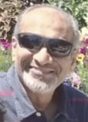

## DLT at Ritsumeikan University
- Date: Wednesday, 11 December 2024
- Time: 13:00-
- Location: Ritsumeikan University
- Host: [Prof Noriaki Kamiyama](/officers/)

## DLT at Nagoya University
- Date: Friday, 13 December 2024
- Time: 14:00-
- - Location: Faculty Conference Room, IB Denshi-Joho-kan 5F, Nagoya University.
  - See [Nagoya University interactive campus map (C3-1)](https://www.nagoya-u.ac.jp/extra/map/index.html).
- Host: [Prof Takaya Yamazato](/officers)

<!-- 12/11 Ritsumeikan University (hosted by our Vice-Chair Prof Kamiyama)
12/13 Nagoya University (hosted by me) -->

# Title: Internet4All through “Internet Lite” for Connect the Unconnected: The Killer App for 5G and Beyond

### Abstract:

Connecting the Unconnected or under-connected (CTU) is the holy grail of transforming the lives of over 3 billion people around the globe with wireless internet who are yet to experience its value in multiple ways. If this could be accomplished, its impact on the society would be enormous as everyone would have access to information and an opportunity to improve their quality of life and income.

This talk endeavors to highlight the need to consider the CTU requirements in 5G and B5G networks to enable affordable solutions. Use of renewable energy sources will enable deployment in remote areas where there is a lack of power grid, or it is intermittent. Thus, this talk identifies a number of technology gaps to be filled in by 5G and B5G networks, such that access is affordable and content and services are actually consumed by the targeted set of users. Although hitherto unexplored, artificial intelligence (AI) and machine learning (ML) have a tremendous role to play for serving the rural and remote communities both to deliver the most needed services and to customize them to the digital capacity of the end users. Technology aside, the need to develop innovative business models is a must to be commercially sustainable in the long-term. A number of such models, especially designed for the rural population, are proposed, such as Village Level Entrepreneur (VLE) Freemium (Free + Premium), revenue sharing among the chain of service providers, subsidized billing by USOF (Universal Service Obligation Funds). Finally, we provide an overview of the IEEE Future Networks Technical Community work on CTU in the CTU working group.

---

## Prof. Sudhir DixitBasic Internet Foundation, Norway &  University of Oulu, Finland

### Bio:

Sudhir Dixit is a Co-Founder and Chief Operating Officer at the Basic Internet Foundation in Oslo, Norway, and heads its US operations in San Francisco, California.  He is also affiliated with the University of Oulu, Finland, where he is a Docent since 2010.  From 2015 to 2017 he was the CEO and Co-Founder of a start-up, Skydoot, Inc. From 2009 to 2015, he was a Distinguished Chief Technologist and CTO of the Communications and Media Services for the Americas Region of Hewlett-Packard Enterprise Services in Palo Alto, CA, and the Director of Hewlett-Packard Labs India in Palo Alto and Bangalore. Before joining HP, he held various engineering and leadership positions at BlackBerry, Nokia, NSN and Verizon Communications.

He has been a technical editor of IEEE Communications Magazine, and was on the editorial board of IEEE Spectrum. He is a Co-Chair of the Industry Engagement Committee of the IEEE Future Networks Technical Community and co-chairs the Connecting the Unconnected working group. In 2018, he was appointed a Distinguished Lecturer by the IEEE Communications Society. He is presently a Board Member & Working Group Chair at the Wireless World Research Forum (WWRF). He is also the Vice President for Americas at the WWRF and Editor-in-Chief of the WWRF magazine Wireless World: Research and Trends (WWRT). From 2010 to 2012, he was an Adjunct Professor of Computer Science at the University of California, Davis, and has been a VAJRA Adjunct Professor at the Indian Institute of Science, Bangalore, India, since 2022. In 2024, he was appointed a Professor of Practice at the SRM Institute of Science and Technology, Chennai, India. He has published 9 books and holds 21 US patents. A Life Fellow of the IEEE, Fellow of IET and IETE, Dixit received a Ph.D. from the University of Strathclyde, Glasgow, U.K. and an M.B.A. from the Florida Institute of Technology, Melbourne, Florida. 
